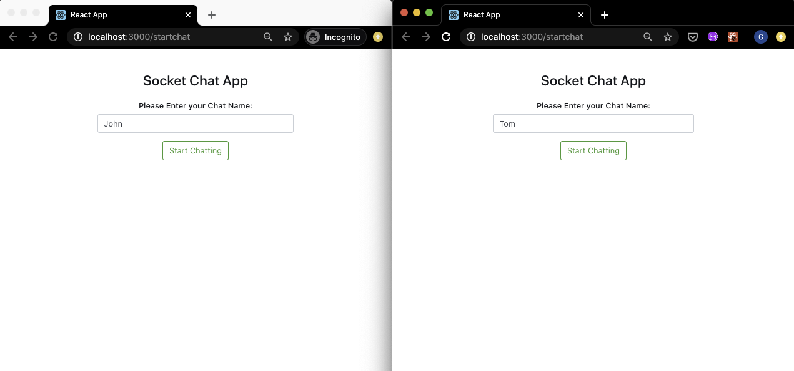

## This is my very First Chat App - **Chitty Chat**

This is my first attemp building a Chat app

Technology used:

- React.js as front-end
- Express.js as back-end server
- Socket.IO
- moment.js

Future Improvements Needed:

1. Clear Chat button should completely clear chat. Currently it clears the chat but also immediately adds a blank conversation box.
2. WhoJustJoin message should be incorporated into the chat history. Currently it is at the top of chat history.
3. UI (background, graphics) could be improved.

Here are screenshots for this app:

This is a bug on my Improvement list (#1)

